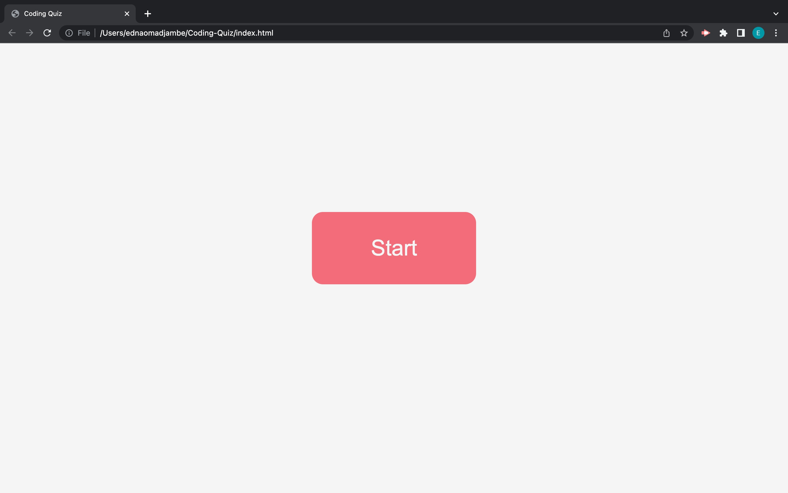

 # coding-quiz

  

## Description

   The following files contain code for a coding quiz.
The quiz contains five questions in total.
It is 75 seconds long.
If a question is answered incorrectly 15 seconds will be deducted from the time
After every answer a display will appear alerting you on whether your answer was correct or not.
At the end there is an input for your initials where your final score will appear alongside it. 

  ## Table of Contents

  - [Installation](#installation)
  - [Usage](#usage)
  - [Contributing](#contributing)
  - [License](#license)
  - [Tests](#tests)
  - [Future-Development](#future-development)

  ## Installation

  To install this project, download the files from my repository at https://github.com/Edna1999/coding-quiz. Open the html file in your browser to view the app.

  You can also visit the deployed webpage via the following link: https://edna1999.github.io/coding-quiz/
  
  ## Usage

  ## Contributing

  - [Edna Omadjambe](https://github.com/Edna1999)

  ## License
  The License being used is: MIT
  If you would like to read more on this please click the badge to navigate to the license page: 
  

  ## Tests

  No tests have been created yet for this project
  
